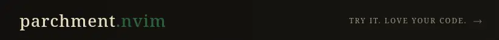

  

Hi, I'm *[Saeed](https://saeeedhany.github.io/Links/).*

- *I build systems, CLI tools, and low-level stuff.*
- *Interested in: OS, architecture, C, and simple web.*

I sometimes *[Write](https://saeedz.vercel.app/)*.
